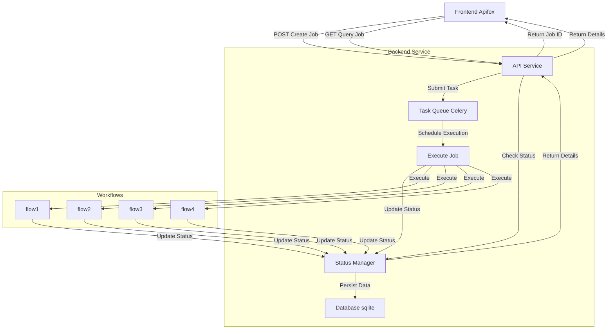

# MarketMind-Flow
AI-powered marketing strategy workflow

## 1. Overview
`MarketMind-Flow` is a project that leverages artificial intelligence to drive marketing strategy workflows. It aims to assist marketers in formulating and executing marketing strategies more efficiently.

## 2. Features
- **Intelligent Analysis**: Utilize AI to conduct in - depth analysis of market data and uncover potential business opportunities.
- **Automated Processes**: Simplify marketing processes and improve work efficiency.
- **Flexible Configuration**: Support various parameter configurations to adapt to different business scenarios.


## 3. System Structure
`src` Directory: Main source code directory containing all core functionalities.
- `api`: Handles API operations and routing (Corresponding `API Service`).
- `config`: Manages project configurations and settings.
- `core`: Contains core business logic and workflows (Corresponding `Workflows`).
- `services`: Provides essential services including task scheduling, database, and LLM integration.
    - `celery`: Manages task scheduling using Celery.
    - `database`: Handles database operations.
    - `llm`: Integrates with LLM services.
- `tasks`: Defines background tasks for marketing workflows (Corresponding `Execute Job`).




## 4. Installation and Usage

### 4.1 Install Dependencies
First, you need to install the required Python packages. You can do this by running the following command:

```bash
pip install -r requirements.txt
```

### 4.2 Install Redis and SQLite
1. Redis Installation (Required for task queue):
 - On macOS (using Homebrew):
    ```bash
    brew install redis
    brew services start redis
    ```
 - On Linux (using APT):
    ```bash
    sudo apt-get update
    sudo apt-get install redis-server
    sudo systemctl start redis
    ```
 - On Windows:
    ```bash
    Download and install manually at https://github.com/microsoftarchive/redis/releases.
    After the installation, start the Redis server：
    redis-server
    ```
2. SQLite Installation (Required for database):
- SQLite is pre-installed on most systems. To verify:
    ```bash
    sqlite3 --version
    ```
- If not installed, follow the official guide: [SQLite Installation](https://sqlite.org/download.html)

### 4.3 Install Apifox (or Postman)
Download and install Apifox from [Apifox Official Website](https://apifox.com/)

### 4.4 Configure the Project
You may need to set up environment variables and modify the configuration files in the config directory according to your needs. For example, you can set the following configurations in ``settings.py``:

1. **Ollama Model Configuration**:
   - `LLM_BASE_URL`: The base URL for Ollama API (default: `http://localhost:11434`)
   - `LLM_MODEL`: The model name to use (default: `qwen2.5:0.5b`)
   - `LLM_API_KEY`: The API key for Ollama (default: `ollama`)

2. **Google Search Configuration**:
   - `SERPER_API_KEY`: Your Google Search API key (required for market analysis)
    ```bash
        os.environ["SERPER_API_KEY"] = "your_api_key_here"
    ```

3. **Database Configuration**:
   - `DATABASE_PATH`: Path to SQLite database file (default: `market-flow.db`)


### 4.5 Run the Project
To run the project, you can use the following command:
1. Start the Celery Worker:
    ```bash
    celery -A src.services.celery.celery_app:app worker \
            --loglevel=info -Q market_flow \
            --without-heartbeat \
            --without-mingle
    ```

2. Start the FastAPI Application:
    ```bash
    uvicorn main:app --host 0.0.0.0 --port 8012
    ```

3. Test with Apifox:

- Create a new POST API in Apifox:
    - Click "New Request" in Apifox
    - Set the request method to POST
    - Enter the URL: `http://127.0.0.1:8012/api/marketflow`
    - In the "Body" tab, select "JSON" format
    - Add the following JSON structure:
    ```json
    {
        "customer_domain": "xxx",
        "project_description": "xxx"
    }
    ```
    - Click "Save" to store the API configuration

- Create a new GET API in Apifox:
    - Click "New Request" in Apifox
    - Set the request method to GET
    - Enter the URL: `http://127.0.0.1:8012/api/marketflow/{job_id}`
    - Click "Save" to store the API configuration

- Send the POST request to create a job, and then send the GET request to query the job status.


## License
This project is licensed under the MIT License. See the LICENSE file for details.

